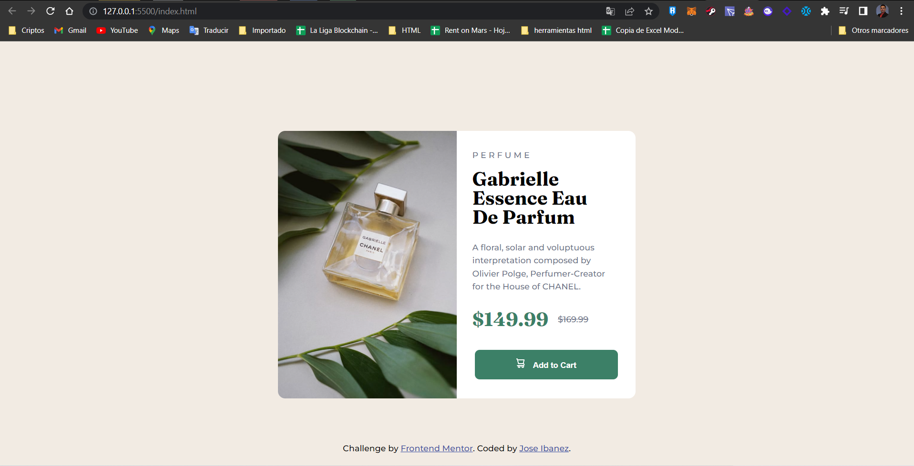
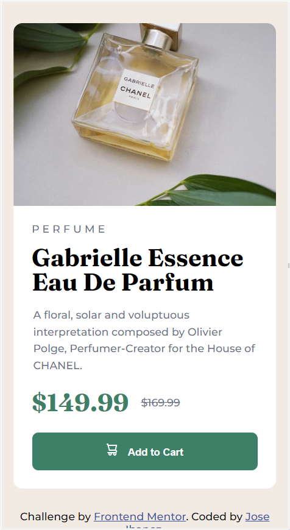

# Frontend Mentor - Product preview card component solution

This is a solution to the [Product preview card component challenge on Frontend Mentor](https://www.frontendmentor.io/challenges/product-preview-card-component-GO7UmttRfa). 

## Table of contents

- [Overview](#overview)
  - [The challenge](#the-challenge)
  - [Screenshot](#screenshot)
  - [Links](#links)
- [My process](#my-process)
  - [Built with](#built-with)
  - [What I learned](#what-i-learned)
  - [Continued development](#continued-development)
  - [Useful resources](#useful-resources)
- [Author](#author)
- [Acknowledgments](#acknowledgments)

## Overview

In this FrontendMentor challenge I have developed a responsive card. It has been made following the specifications requested for the challenge and using only HTML and CSS

### The challenge

Users should be able to:

- View the optimal layout depending on their device's screen size
- See hover and focus states for interactive elements

### Screenshot

## My process

A card was made applying flexbox with vertical orientation for the mobile version and with horizontal orientation for the desktop version.

### Built with

- Semantic HTML5 markup
- CSS custom properties
- BEM
- Flexbox
- Mobile-first workflow

## Author

- Frontend Mentor - [@Ibanezense](https://www.frontendmentor.io/profile/Ibanezense)
- Twitter - [@Josibanezm](https://twitter.com/Josibanezm)

